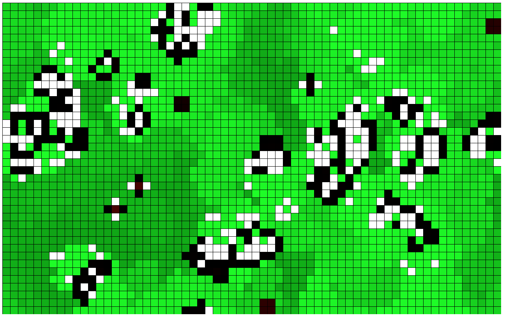

# Game of Life

This is my take on [The Coding Train](http://thecodingtrain.com) Coding Challenge #085.

Link: https://thecodingtrain.com/CodingChallenges/085-the-game-of-life.html

This is the classic Game of Life by Conway.

For each iteration a cell is either alive or dead by the following rules:

- If a cell is dead and has exactly three neighbours, it is resurrected.
- If a cell is alive and has any other number than three neighbours, it is killed.

Alive cells are coloured black. Dead cells are white.
An age counter is added to each cell, turning alive cells more and more red and dead cells more and more green.
