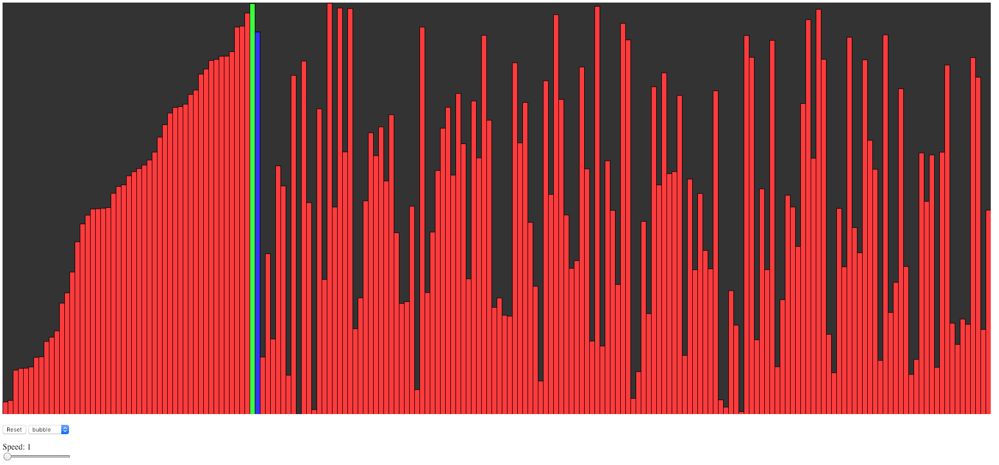

# Visualization of Sorting

This is my take on [The Coding Train](http://thecodingtrain.com) Coding Challenge #114.

Link: https://thecodingtrain.com/CodingChallenges/114-bubble-sort.html

We are sorting bars of random height.

There is a drop-down menu to select the type of sorting (currently `bubble` and `selection` are available).

The slider tells us how many bars to sort per draw cycle.

The reset button resets the system back to start and starts sorting again.
